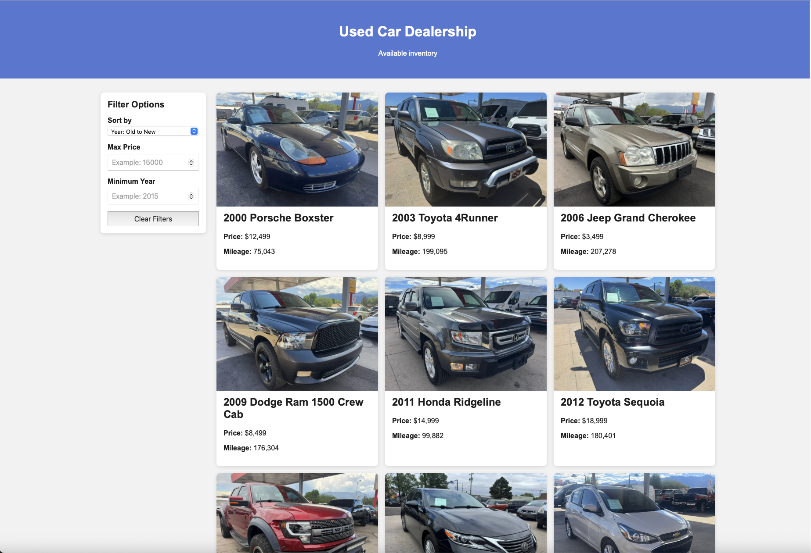
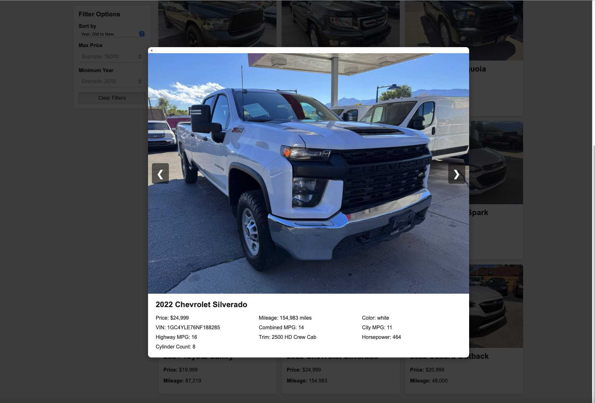

# Car_Dealership_cs355 Orginal Project Intentions

### Group Name: Group 5

### Group Members
- Arturo Nunez Gomez
    - nunezgomea@sonoma.edu
- Homero Arellano
    - arellanome@sonoma.edu
- Tadhg Cahill
    - cahillt@sonoma.edu
- Emilio Orozco
    - orozcoem@sonoma.edu

## 1. Application Description
Our database aims to create a tool that would be utilized by a car dealership. The creation of this database would allow the end-users(people running a car dealership and customers themselves, based on their ‘read permissions’) to retrieve valuable information with ease and with views that are readable. The database takes into account sales, finance, and service departments, as well as employees and customers.
## 2. Requirements Analysis
Our database will serve a used car dealership's needs, with the core focus being tracking and managing vehicles. This primarily pertains to inventory tracking to streamline the buying and selling of vehicles. This inventory management will track the vehicle's make, model, year, color, trim, mileage, whether it is pre-owned, any damages, and if it is ready to be purchased. The dealership's users fall into two categories: customers and employees, who alike may search the database for vehicles by filtering by price, make, size, mileage, and age, to name a few, employees will manage vehicles by manipulating sales, purchases, rentals, leases, and trade-ins directly in the database. The database will also retain records on employees and customers accounts. This will include the employee’s department, pay type, amount, and tenure. The information on customers will include previous purchases, name, phone number, id, and credit score if damage, previous ownership, among other attributes are left null, then that means it is not applicable (or none).
## 3. Example Queries (Questions)
Query 1: [all vehicles currently ready to purchase, with a year after 1999 and selling for less than $10,000]
    
Query 2: [A query that retrieves information of customers and vehicles they have purchased from that deaership. This will be useful for salespeople to contact them regarding trade-ins/upgrades or for service to contact them about their maintenance.]
    
Query 3: [A query that can retrieve information about the sales department’s workers and cars sold. This would be useful for commission information.]
    
Query 4: [A query that will update the status of a vehicle. This allows the dealership to  view/update if a vehicle is sold, financed/leased, in transit, or available]
## 4. Preliminary Data Model
Entities: Employee, Department, Vehicle, Customer
    
Relations: works for (employee to department), purchased ( customer to vehicle), leasing/financing ( customer to vehicle), sold (employee to vehicle (for commission)),
    
Employee attributes: employee id (key), name, pay type (hourly, salary, commission), pay amount, address, tenure, phone number, department
    
Department attributes: type (management, admin / human resources / sales / auto repair / financing) (key)
    
Vehicle attributes: make, model, year, vin (key), trim, damage, title status, pay type (financing, sold outright, lease), price, previous ownership, mileage, maintenance history, isReadyToPurchase (boolean), 
    
Customer attributes: id (key), name, previous purchases, credit score, address, phone number, 
    
Customer driving vehicle attributes: payment type (bought, lease (if lease time remaining), financing) remaining balance
## 5. Additional Notes
We are assuming this is a single location car dealership
We are not accounting for repos, returns, theft, natural disaster, fraud, or any other extraordinary circumstances

# Website Addon
This website would change how the database is used. There are modifications to **Vehicle attributes**. Those would include removal of **title status**, **pay type**, **previous ownership**, **maintenance history**, and **isReadyToPurchase**. Then the introduction of **combined_mpg**, **cylinder_count**, **city_mpg**, **highway_mpg**, and **automatic (boolean)**. Only the **Vehicle** entity is used; others are unused. A new entity called **VehicleImages** is made to store the paths of the images for each car.

## Features
- Display vehicles from MySQL
- Shows vehicles images
- Ability to click on a vehicle for more information and browse thorugh all images related 
- Sort by year or price
- Filter by max price and minumum year

## Tech Stack
- Node.js
- Express
- MySQL
- HTML
- CSS
- JavaScript

NPM is required to be installed for create .env file

# Sample images of website

